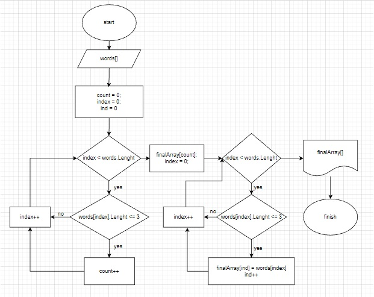

# Тестовое задание 

## Описание решения:

* Во-первых я создала начальный массив слов;
* Во-вторых создала счетчик *counter*, который посчитает количество ячеек, в которых менее 3х символов;
* Итоговый массив заполнила словами из начального массива, которые менее 3х символов.
* Вывела массив.

**Блок-схема:**

